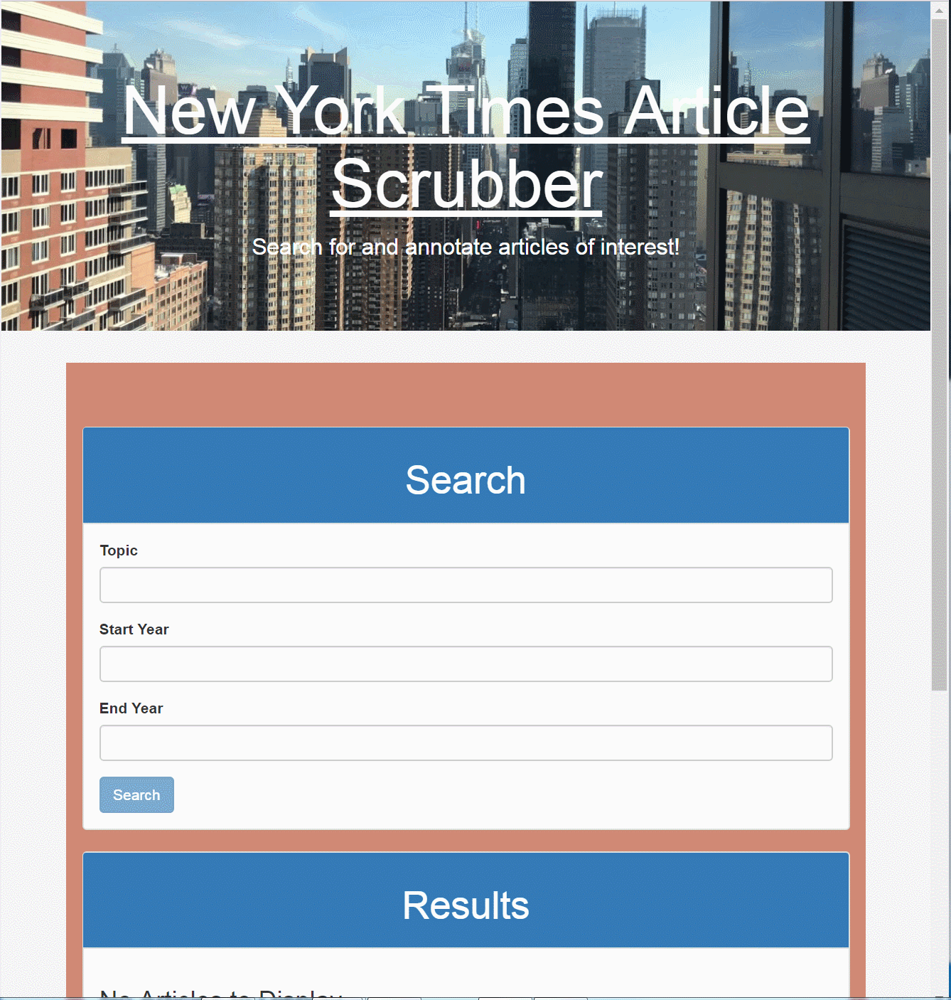

# NYT-React
Single page MERN application to search and save New York Times articles. Uses MongoDB, Mongoose ORM, Node, Express and React.

This is a full stack news application which allows users to search, view and save New York Times articles.

The user has the following options:
1) Search the New York Times API and view the most recent 5 articles. The search topic is required. Start and end years are optional. Start year begins on January 1st. End year stops on December 31.
2) Save articles to the database.
3) Remove saved articles from the database.

Finally, the user can click on any article headline and a new page will open which follows the link for the headline.

Please refer to the video below for details regarding how the app works.

## Getting Started

You should be able to download the files via the github pages link below and run locally on your computer:
[https://github.com/emswann/nyt-react](https://github.com/emswann/nyt-react).

The application has also been published on Heroku:
[https://nyt-react-ems.herokuapp.com/](https://nyt-react-ems.herokuapp.com/).

## Prerequisites

NPM install based on package.json.

## Built With

* [JavaScript](https://www.javascript.com/) - Programming language.
* [JSX](https://reactjs.org/docs/introducing-jsx.html) - Syntax extension to Javascript and used for React development.
* [react](https://reactjs.org/) - Javascript library for building user interfaces.
* [react-bootstrap](https://react-bootstrap.github.io/) - Front-end framework rebuilt for React.
* [react-dom](https://reactjs.org/docs/react-dom.html) - Provides DOM-specific methods within React.
* [react-router-dom](https://www.npmjs.com/package/react-router-dom) - Provides DOM bindings for React Router.
* [react-scripts](https://www.npmjs.com/package/react-scripts) - Provides configuration and scripts for Create React App.
* [axios](https://www.npmjs.com/package/axios) - Promise based HTTP client for the browser and Node.js
* [node.js](https://nodejs.org/en/) - Server side programming language.
* [express](https://www.npmjs.com/package/express) - Web application framework used for server side routing.
* [mongoose](https://www.npmjs.com/package/sequelize) - Promised based ORM for using MongoDB in Node.js
* [body-parser](https://www.npmjs.com/package/body-parser) - Middleware parser used for incoming request bodies.

## Contributing

Please feel free to offer any suggestions. As always, programming is a work of art in progress.

## Author

* **Elaina Swann** - [Github](https://github.com/emswann)
